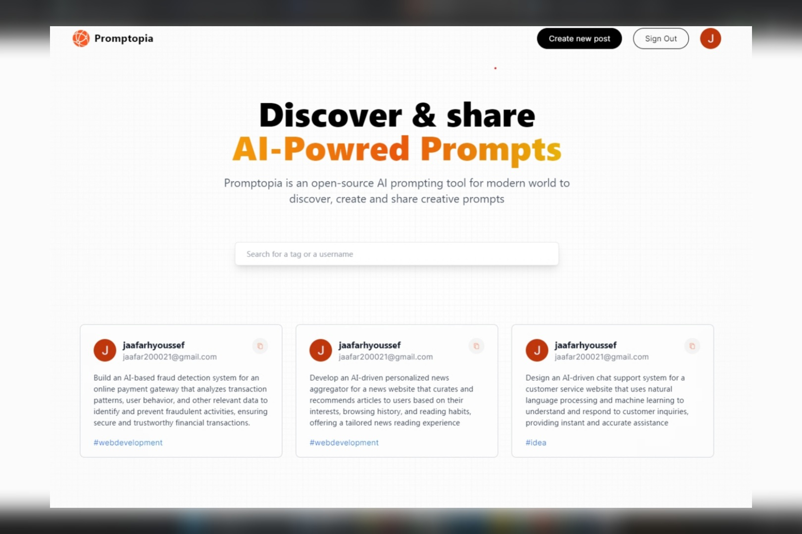
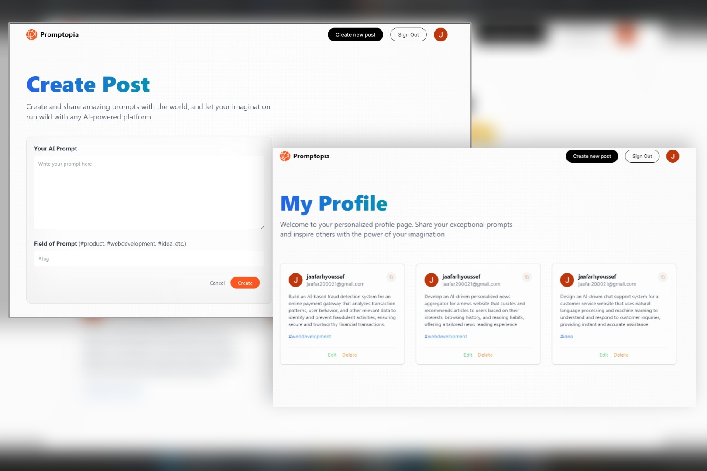

# Promptopia
Full-stack application built with Next.js allows users to sign in, create AI prompts, and share them. It incorporates user authentication using NextAuth.js, and Mongo DB for storing data. 

## Welcome!

Thanks for checking out this Application.

### Links

- Live Site URL: [Live Site](https://promptopia-738s4e3l6-jaafar2000.vercel.app/)

## Overview

## My process

### Built with

- NEXT.Js 13
- Tailwind CSS 
- NextAuth.js
- mongoDB
- JavaScript
- JSX

## Author

- Linkedin - [@jaafar youssef](https://www.linkedin.com/in/jaafar-youssef-923100249/)

jaafar youssef
